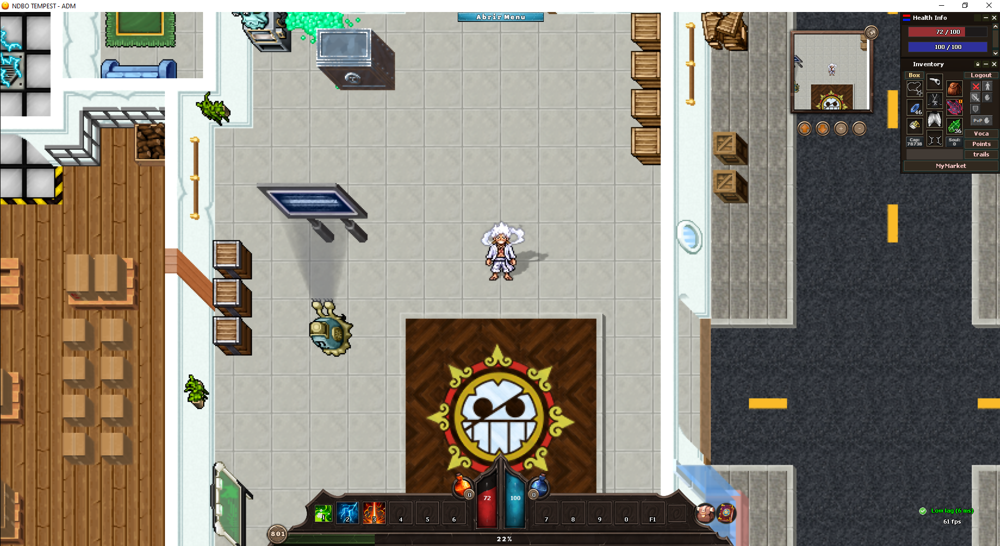
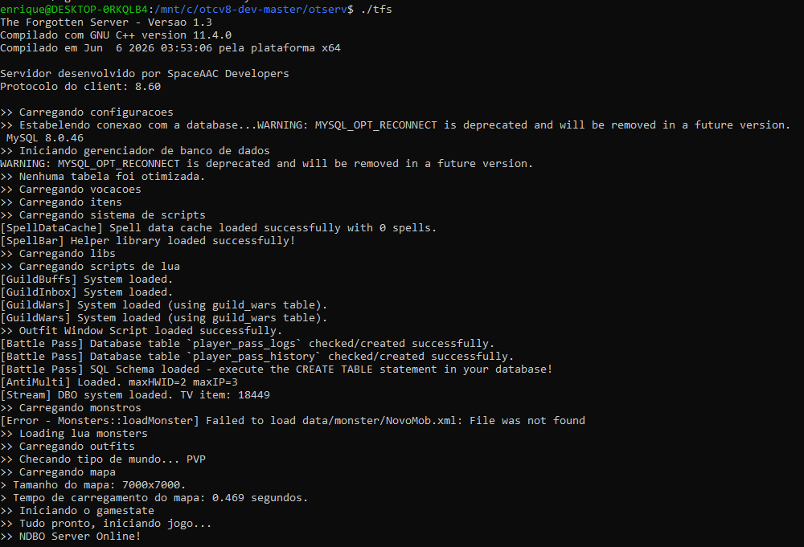

# SERV — Servidor TFS (OTCv8)

Servidor OpenTibia baseado em **TFS 1.x** (C++14), compilado com **CMake**.
Cliente **não** está incluído neste repositório (distribuído à parte via Drive).

## Cliente (download)

O cliente OTCv8 está disponível no Google Drive:

**➡️ [Baixar cliente](https://drive.google.com/file/d/1sspwKHHubbaXDQrJyjT1b2RgeFW-Cyjl/view?usp=drive_link)**

## Screenshots

### Gameplay (cliente OTCv8)



### Servidor online (log de inicialização)



---

## Requisitos

- Linux (Debian/Ubuntu) — no Windows, use **WSL2**
- CMake ≥ 2.8, GCC/G++ com suporte a C++14
- MySQL / MariaDB

### Dependências (bibliotecas)

- Boost ≥ 1.53 (`system`, `filesystem`, `iostreams`)
- LuaJIT (ou Lua 5.x como fallback)
- MySQL client
- Crypto++
- PugiXML
- fmt ≥ 6.1.2
- ZLIB

---

## 1. Instalar dependências (Debian / Ubuntu / WSL)

```bash
sudo apt update
sudo apt install -y \
  git cmake build-essential \
  libluajit-5.1-dev \
  libmysqlclient-dev \
  libboost-system-dev libboost-filesystem-dev libboost-iostreams-dev \
  libpugixml-dev \
  libcrypto++-dev \
  libfmt-dev \
  zlib1g-dev
```

> Se `libmysqlclient-dev` não existir, use `libmariadb-dev`.
> Se `libfmt-dev` for < 6.1.2, instale o fmt manualmente.

---

## 2. Compilar

Build **fora da árvore de código** (o CMake bloqueia in-source build):

```bash
mkdir -p build
cd build
cmake ..
make -j$(nproc)
```

Gera o executável `build/tfs`. Copie-o para a raiz do servidor:

```bash
cp tfs ..
cd ..
```

---

## 3. Banco de dados

Crie o banco e o usuário, depois importe o schema `dbo.sql`:

```bash
mysql -u root -p -e "CREATE DATABASE dbo; \
  CREATE USER 'tibia'@'localhost' IDENTIFIED BY 'tibia123'; \
  GRANT ALL PRIVILEGES ON dbo.* TO 'tibia'@'localhost'; \
  FLUSH PRIVILEGES;"

mysql -u tibia -p dbo < dbo.sql
```

Config padrão (em `config.lua`):

| Campo          | Valor       |
| -------------- | ----------- |
| mysqlHost      | 127.0.0.1   |
| mysqlUser      | tibia       |
| mysqlPass      | tibia123    |
| mysqlDatabase  | dbo         |
| mysqlPort      | 3306        |

> ⚠️ **Troque a senha `tibia123`** antes de expor o servidor.

---

## 4. Rodar

```bash
./tfs
```

### Windows (WSL)

Use `run_server_wsl.bat` — ele copia o binário do `build/` e inicia o `tfs` via WSL.

---

## Portas

| Protocolo | Porta |
| --------- | ----- |
| Login     | 7171  |
| Game      | 7172  |
| Status    | 7171  |

Ajuste em `config.lua` (`loginProtocolPort`, `gameProtocolPort`, `statusProtocolPort`).

---

## Estrutura

```
SERV/
├── src/          código-fonte C++ (TFS)
├── data/         scripts Lua, mapa, itens, monstros, npc...
├── cmake/        módulos Find*.cmake
├── CMakeLists.txt
├── config.lua    configuração do servidor
├── dbo.sql       schema do banco
└── key.pem       chave RSA
```
